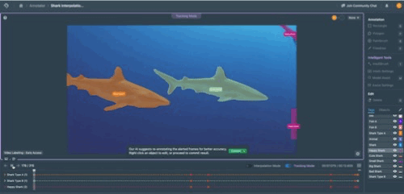
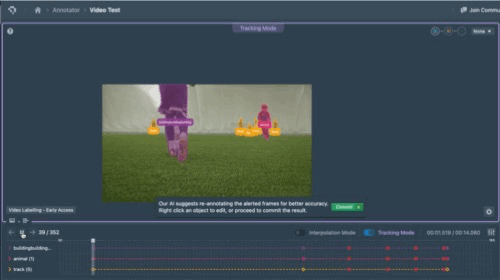
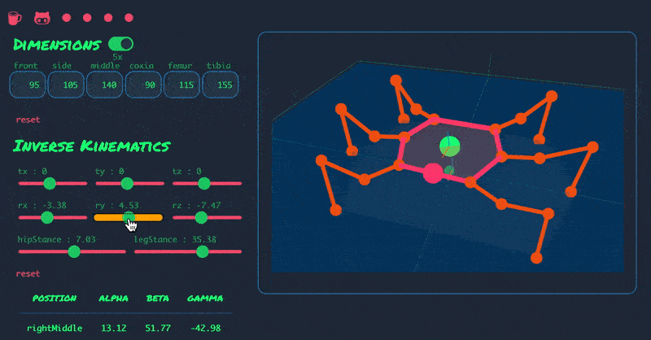
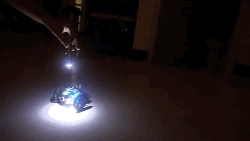
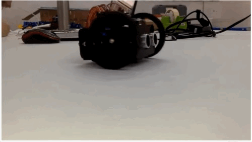
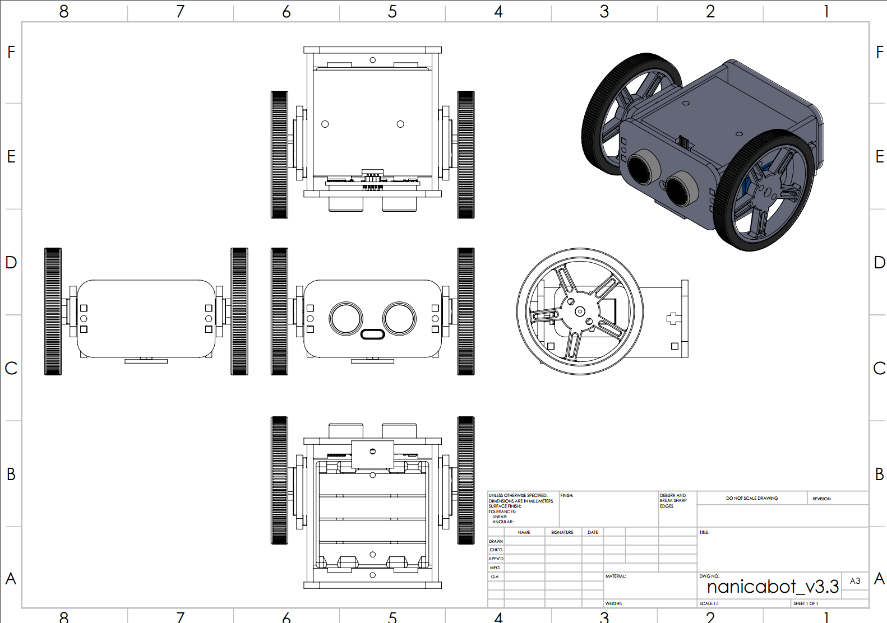

# (Mithi) Shulamith Sevilla - Selected Works

Hi, I'm Mithi — a frontend engineer and former robotics teacher / creative technologist. Currently, I'm most interested in designing and developing human-AI interfaces that leave people more skillful, more deliberate, and happier than they found them. View my [Resume](https://docs.google.com/document/d/1OlH_3r2XrZcFldRtcRe_oUKvq_N7wvVwd4fasFS9A5o/edit?usp=sharing), [GitHub](https://github.com/mithi/), [LinkedIn](https://www.linkedin.com/in/minimithi/), or [Medium](https://medium.com/@mithi).

Below are some things I helped bring to life.

## Contents

1. [Highlighted Projects](#highlighted-projects)
2. [Recent Interactive Tools](#recent-interactive-tools-2025---present)
3. [Early Talks and Workshops](#early-talks-and-workshops)
4. [Creative Hardware and Early Robotics Education](#creative-hardware-and-early-robotics-education)

## Highlighted Projects

### AI Assisted Annotation Tools (2022 - 2024)

One of [Datature](https://datature.io/)'s core capabilities: AI-assisted annotation, where specialized models turn painstaking manual outlining into a few clicks. I led the UX implementation and design, working closely with backend and ML engineers.

- [📺 👀 Watch: Some interfaces I built at Datature](https://www.youtube.com/watch?v=33zJy7tHo3w) (2-minutes)
- 📖 Datature Developer Docs: [Video Tracking](https://developers.datature.io/docs/video-tracking), [Everything Mode](https://developers.datature.io/docs/everything), [Intellibrush](https://developers.datature.io/docs/intellibrush)

|          |  |
| ------------------------------------------------ | --------------------------------------------------- |
|  |    |

### Hexapod Robot Simulator (2020)

An _extremely_ lightweight [hexapod simulator](https://github.com/mithi) that you can run it on a low-end phone — lowering the barrier to exploring inverse kinematics and walking gaits. Featured on Hacker News, Adafruit, and Weekly Robotics among others and found a positive reception in maker communities, notably inspiring a [Python port](https://github.com/XuelongSun/HexapodRobotSimulation) in China.

- [🔗 👀 Look! A collection of places where Hexapod Robot Simulator was mentioned](https://github.com/mithi/docs-archive/blob/main/hexapod-mentions.md)

<table>
  <tr>
    <td width="25%"></td>
    <td width="35%"></td>
    <td width="40%"></td>

  </tr>
</table>

### React Philosophies (2021)

An [essay](https://github.com/mithi/react-philosophies) exploring software design principles in React — spread by word of mouth into newsletter features, translations, and references from developers internationally, including Japan, Korea, and beyond.

- [🔗 👀 Look! A collection of places where React Philosophies was mentioned](https://github.com/mithi/docs-archive/blob/main/react-philosophies-mentions.md)

## Recent Interactive Tools (2025 - Present)

At PikaPikaGems, I own product design of two language learning tools from concept to execution while helping backend with decisions, architecture, and delivery.

1. [ririkku.com](https://ririkku.com) - A Japanese song lyric immersion app with AI text analysis and gamified flashcards.
2. [kanjiheatmap.com](https://kanjiheatmap.com) - A unique kanji study tool built with speed and user experience front and center.

## Early Talks and Workshops

1. Malicious Attacks to Neural Networks: Adversarial Examples for Humans. Trend Micro Philippines Decode Event, 2018
   - [📖 Transcript](https://github.com/mithi/sdc-talk)

2. DIY Self-Racing Cars: A workshop problem-solving philosophy, machine learning intuitions, and behavioral cloning. Delivered to Trend Micro Philippines 2018.
   - [🔖 Slides, Materials](https://github.com/mithi/sdc-talk)

3. Udacity Self Driving Cars Lessons. I was one of three session leads hired to faciliate learning of senior employees at Infosys India 2017.
   - [📖 Read about my experience](https://medium.com/@mithi/2f3995130249)
   - [📺 Watch: Session One](https://youtu.be/UbtnLhvMA8E) (~10 minutes)

4. Create Tech Sessions: Reimagining Consumer Experiences with Creative Technology. I conducted sessions to help creatives at Dentsu Jyme Syfu ideate how technology can be creatively applied to brand campaigns, 2016
   - [📺 Watch: Session One](https://www.youtube.com/watch?v=BNNJ5k0AFH0) (~10 minutes, ⚠️ no sound)

5. A Raspberry Pi Hexy: How I Practiced Clean Code and Made a Hexapod Robot Dance — Python Conference Philippines 2016
   - [📖 Transcript](https://medium.com/@mithi/a-raspberry-pi-hexy-transcript-62533c69a566)

## Creative Hardware and Early Robotics Education

Before web engineering, I helped build physical things — robots for classrooms, ad agencies, and art collaborations.

### Probbie: Dentsu Jayme Syfu's Friendly Robot Receptionist (2016)

This child-sized robot with autonomous navigation, person detection, and voice interaction which helped [Dentsu Jayme Syfu](http://dentsucreative.ph/) win Campaign Southeast Asia's 2016 Creative Agency of the Year. I was in charge of programming, electronics selection, and overseeing construction.

- [📖 Read about my experience](https://medium.com/@mithi/building-a-voice-activated-robot-for-an-advertising-agency-fedaa9f347d3)
- [📺 Dentsu Jayme Syfu's Probbie Case Video 2017 ](https://www.youtube.com/watch?v=Vm52cbjBIXY) (2-minutes)

|  |  |
| ----------------------------- | ----------------------------- |
| .                             | .                             |

### Plant Cyborgs — with artist Daniel Slåttnes (2017, 2020)

A robotic body moved by a houseplant's own biosignals — artist Daniel Slåttnes' work exhibited in events like Meta.Morf X Biennale (2020) and the Arctic Arts Festival (2021). I was commissioned to do calibration, movement programming, and sensors/electronics integration support.

|  |  |
| ----------------------------------- | ----------------------------------- |
| .                                   | .                                   |

- [🔗 Daniel Slåttnes Official Website](https://slaattnes.com/)

### Maya: The Affordable Robot For Everyone (2015)

A ~$30 100% open-source robot designed to make early STEM education accessible — CAD files, PCB designs, and lesson plans all freely downloadable.

<table>
  <tr>
    <td width="50%"></td>
    <td width="50%"></td>
  </tr>
  <tr>
    <td width="50%"></td>
    <td width="50%"></td>
  </tr>
</table>

Maya is the flagship project of Nanica Labs (2014–2016), the robotics education startup I co-founded — a Top 3% finalist (of 500+ applicants) in the [IdeaSpace](https://www.ideaspace.vc/) Startup Competition 2016.

- [🔖 Maya Artifacts (Materials)](https://github.com/nanicalabs/robot-maya)
- [📺 Watch: Looking Back: Nanica Year-end Video (~3 minutes)](https://www.youtube.com/watch?v=rtS7y3G6EyI)
- [📺 Watch: Ideaspace Pitch (2 minutes)](https://www.youtube.com/watch?v=hNzD0EEuWf8)
- [🔗 Nanica's Official Blog](https://medium.com/@nanicalabs)

_Last updated: July 2026_
